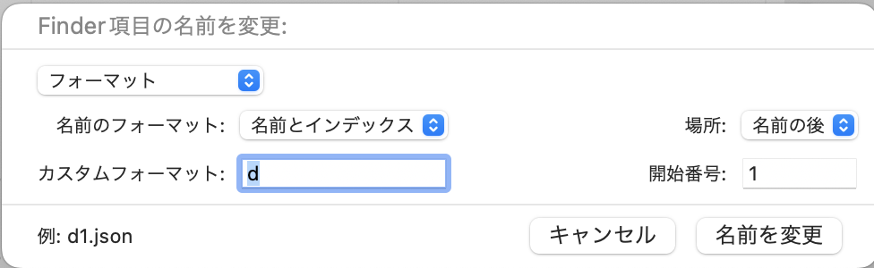
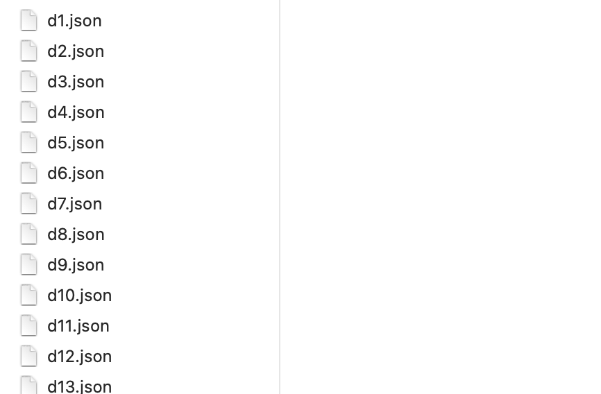

## labelImgのjsonファイルを結合し、CreateML object detector用のデータ形式に直すフォーマッタ

### 1. このリポジトリをクローン（ダウンロードする）  

### 2. ファイル名を連番にする  
- 名称変更したいjsonファイルを全選択→右クリック→「名称変更」  
  
  

### 3. `index.ts`を開き、以下の項目を編集
```ts
//結合したいjsonファイルが入ったフォルダのパス
const BASE_PATH = "/Users/owner/Downloads/KaraokeClassifierData/TrainingData/labeledImgData"
//command + option + C でファイルのパスをコピーできるので便利

//ファイルの数
const NUM = 46
```  

### 4. ターミナルを開き、このプロジェクトのディレクトリに移動し、以下を実行  
```
npm run start
```

### 5. プロジェクトディレクトリ内に`output.json`というファイルが生成される。